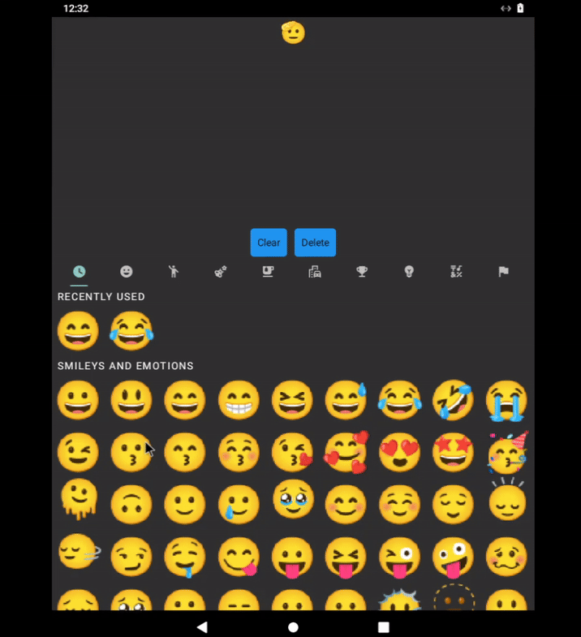

<h1 align="center">
  react-native-emoji-keyboard 🌈
</h1>

<p align="center">
  <strong>Emoji Keyboard for React Native, using native primitives.
</strong><br>
This is a fork of <a href="https://github.com/okwasniewski/@abdoalghoul/react-native-emoji-keyboard">okwasniewski/react-native-emoji-popup</a>
</p>

<div align="center">

[](https://github.com/okwasniewski/@abdoalghoul/react-native-emoji-keyboard/blob/main/LICENSE)
[](https://www.npmjs.org/package/@abdoalghoul/react-native-emoji-keyboard)
[](https://www.npmjs.org/package/@abdoalghoul/react-native-emoji-keyboard)
[](https://www.npmjs.org/package/@abdoalghoul/react-native-emoji-keyboard)

</div>

Note: This was not tested on IOS, only tested on Android but it should work, if you can help me to test it on IOS please do so.

|                                     Android Preview                                      | IOS Preview |
| :--------------------------------------------------------------------------------------: | :---------: |
|  |     :x:     |

## Installation

```sh
npm i @abdoalghoul/react-native-emoji-keyboard
```

## Usage

The API is simple, render the `EmojiKeyboard` component and pass a callback to the `onEmojiSelected` prop.

```js
import { EmojiKeyboard } from '@abdoalghoul/react-native-emoji-keyboard';

export default function EmojiExample() {
  const [emoji, setEmoji] = useState('🫡');

  return (
    <View style={styles.container}>
      <Text style={styles.emojiText}>{emoji}</Text>
      <EmojiKeyboard
        containerStyle={styles.emojiContainer}
        emojiViewStyle={styles.emojiView}
        onEmojiSelected={setEmojiHandler}
      >
        <View style={styles.buttonsView}>
          <Pressable style={styles.buttonText} onPress={clearInput}>
            <Text>Clear</Text>
          </Pressable>
          <Pressable style={styles.buttonText} onPress={deleteLastEmoji}>
            <Text>Delete</Text>
          </Pressable>
        </View>
      </EmojiKeyboard>
    </View>
  );
}
```

## Props

| Prop                 | Type                      | Platform     | Description                                                       | Default |
| -------------------- | ------------------------- | ------------ | ----------------------------------------------------------------- | ------- |
| `children`           | `React.ReactNode`         | iOS, Android | Children to render _before_ the emoji keyboard                    | -       |
| `onEmojiSelected`    | `(emoji: string) => void` | iOS, Android | Callback function that receives the selected emoji as a parameter | -       |
| `containerViewStyle` | `StyleProp<ViewStyle>`    | iOS, Android | Style object for the container view                               | -       |
| `emojiViewStyle`     | `StyleProp<ViewStyle>`    | iOS, Android | Style object for the emojis view                                  | -       |

## Contributing

See the [contributing guide](CONTRIBUTING.md) to learn how to contribute to the repository and the development workflow.

## License

MIT

## Acknowledgements

- [MCEmojiPicker](https://github.com/izyumkin/MCEmojiPicker) - underlying iOS library.
- [Emoji2](https://developer.android.com/jetpack/androidx/releases/emoji2) - underlying Android library.

---

Made with [create-react-native-library](https://github.com/callstack/react-native-builder-bob)
